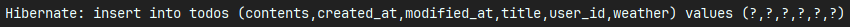
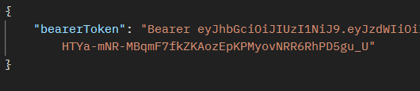
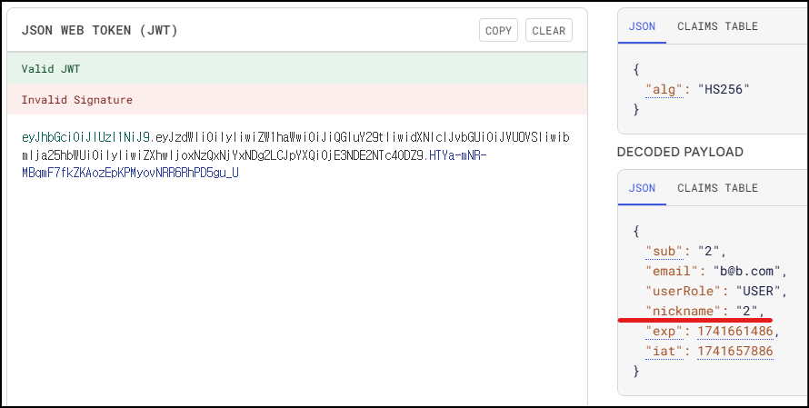
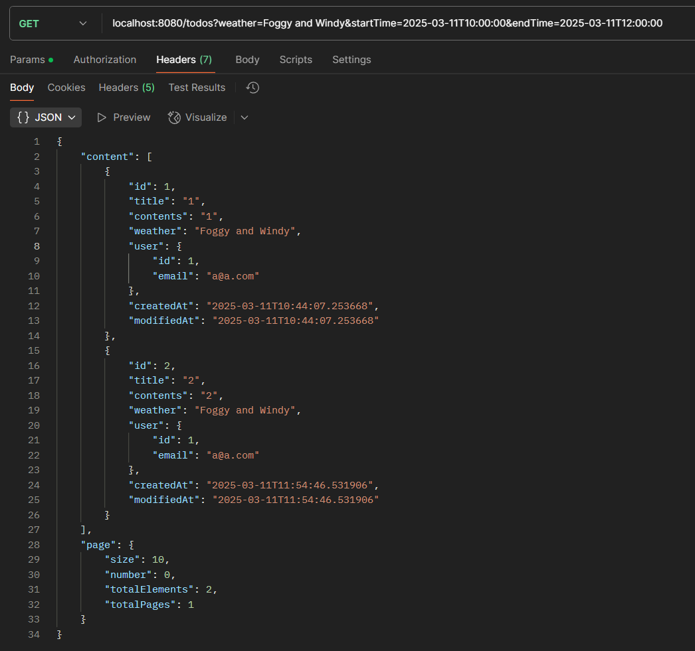
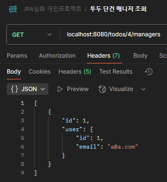
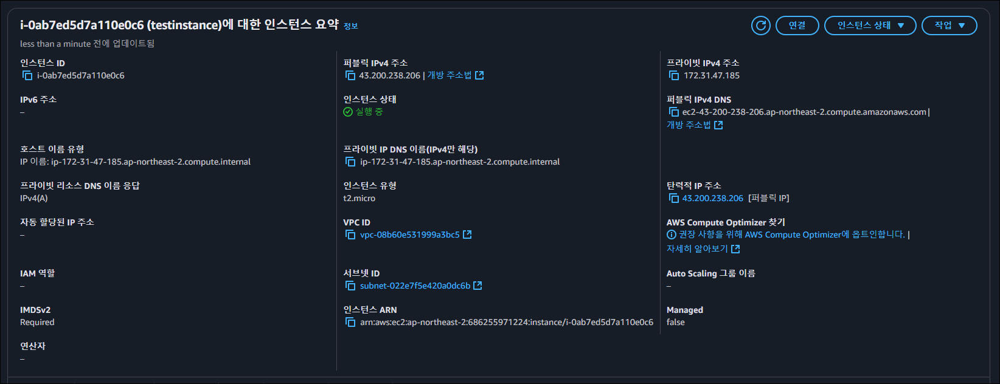
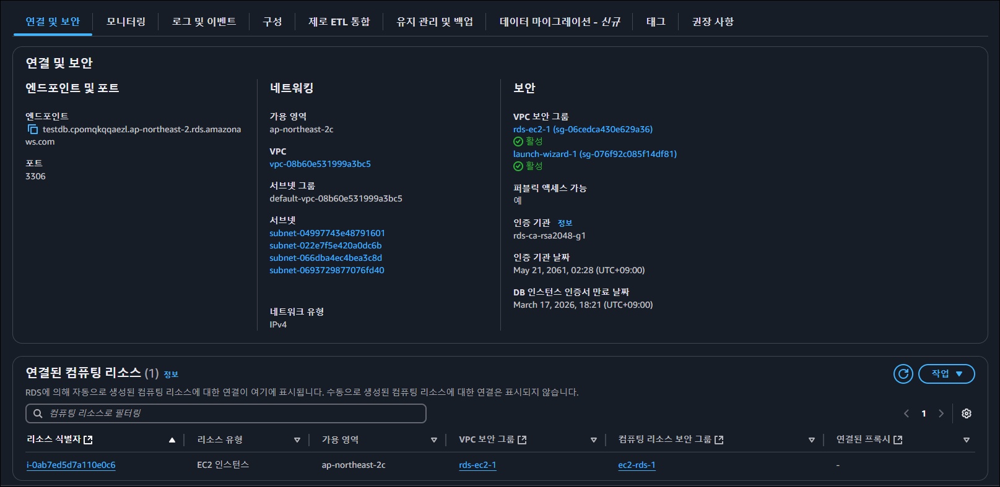

# SPRING PLUS

## Lv.1 코드 개선 퀴즈 - @Transactional 의 이해

- 파일위치 :  
package org.example.expert.domain.todo.service.TodoService
---

### 1. 원인
(A) 에러 원문
```text
jakarta.servlet.ServletException: Request processing failed: org.springframework.orm.jpa.JpaSystemException: could not execute statement [Connection is read-only. Queries leading to data modification are not allowed] [insert into todos (contents,created_at,modified_at,title,user_id,weather) values (?,?,?,?,?,?)]
```
(B) 원인 파악 
- 데이터가 변경되어야 할 메서드까지 클래스 단계에서 전역적으로 @Transactional(readOnly = true)가 설정되어 있어, JPA Insert 문이 실행되지 않음.

### 2. 해결

1. 데이터의 변경, 조회, 삭제가 진행되는 매서드에 @Transactional 작성. (조회 매서드는 readOnly = Ture 설정)

## Fixed

```java
@Service
@RequiredArgsConstructor
//@Transactional(readOnly = true)  // 전역 설정 주석처리
public class TodoService {

    /**
     * 데이터의 추가, 변경, 삭제 매서드에 @Transactional 작성
     */
    @Transactional
    public TodoSaveResponse saveTodo(AuthUser authUser, TodoSaveRequest todoSaveRequest) {
        // 비즈니스 로직...
        Todo savedTodo = todoRepository.save(newTodo);
        // 비즈니스 로직...
    }

    @Transactional(readOnly = true) // 조회는 readOnry = true 설정
    public Page<TodoResponse> getTodos(int page, int size) {
        // 비즈니스 로직...
        Page<Todo> todos = todoRepository.findAllByOrderByModifiedAtDesc(pageable);
        // 비즈니스 로직...
    }

    @Transactional(readOnly = true) // 조회는 readOnry = true 설정
    public TodoResponse getTodo(long todoId) {
        // 비즈니스 로직...
        Todo todo = todoRepository.findByIdWithUser(todoId)
                .orElseThrow(() -> new InvalidRequestException("Todo not found"));
        // 비즈니스 로직...
    }
}
```

## Lv.2 코드 추가 퀴즈 - JWT의 이해

- 파일위치 :  
package org.example.expert.domain.user.entity.User  
package org.example.expert.domain.user.service.UserService  
package org.example.expert.domain.user.controller.UserController  
package org.example.expert.config.JwtUtil  
package org.example.expert.domain.auth.dto.request.SignupRequest  
package org.example.expert.domain.auth.service.AuthService
---

### 1. 원인
1. 기획자의 요구사항 : User 정보에 nickname 추가.
2. 프론트엔드 개발자 요구사항 : JWT에서 nickname 을 꺼내 보여주길 원함.

### 2. 해결




1. User Entity에 nickname 필드 추가.
2. 컨트롤러와 서비스에 nickname 업데이트 기능을 추가하여, 기존 사용자도 문제없이 추가 할 수 있도록 수정.
3. JWT에 해당 nickname 추가. (JwtUtil, AuthService)

## Fixed

```java
@Getter
@Entity
@NoArgsConstructor
@Table(name = "users")
public class User extends Timestamped {
    //...
    
    private String nickname; // nickname 필드 추가

    public User(String email, String password, UserRole userRole, String nickname) {
        this.email = email;
        this.password = password;
        this.userRole = userRole;
        this.nickname = nickname; // 생성자에 nickname 추가
    }
    
    // 유저 nickname 업데이트 매서드 추가
    public void updateNickname(String nickname){
        this.nickname = nickname;
    }
    
    // ...
}
```
```java
@Service
@RequiredArgsConstructor
@Transactional(readOnly = true)
public class UserService {

    // ...

    // 기존 유저도 닉네임 추가할 수 있도록 API 작성
    @Transactional
    public void updateNickname(long userId, String nickname){
        User user = userRepository.findById(userId)
                .orElseThrow(() -> new InvalidRequestException("User not found"));

        user.updateNickname(nickname);
    }

    // ...
}
```
```java
@RestController
@RequiredArgsConstructor
public class UserController {

    // ...
    
    // 기존 유저도 닉네임 추가할 수 있도록 API 작성
    @PatchMapping("/users")
    public void updateNickname(@Auth AuthUser authUser, @RequestParam String nickname){
        userService.updateNickname(authUser.getId(), nickname);
    }
}
```
```java
@Slf4j(topic = "JwtUtil")
@Component
public class JwtUtil {

    // ...
    
    public String createToken(Long userId, String email, UserRole userRole, String nickname) {
        Date date = new Date();

        return BEARER_PREFIX +
                Jwts.builder()
                        .setSubject(String.valueOf(userId))
                        .claim("email", email)
                        .claim("userRole", userRole)
                        .claim("nickname", nickname) // JWT 토큰에 nickname 추가
                        .setExpiration(new Date(date.getTime() + TOKEN_TIME))
                        .setIssuedAt(date)
                        .signWith(key, signatureAlgorithm)
                        .compact();
    }

    // ...
}
```

```java
@Getter
@NoArgsConstructor
@AllArgsConstructor
public class SignupRequest {

    // ...
    private String nickname; // RequestDto에 닉네임 추가
}
```
```java
@Service
@RequiredArgsConstructor
@Transactional(readOnly = true)
public class AuthService {
    
    @Transactional
    public SignupResponse signup(SignupRequest signupRequest) {
        // ...
        
        // JWT 토큰에 nickname 추가
        String bearerToken = jwtUtil.createToken(savedUser.getId(), savedUser.getEmail(), userRole, savedUser.getNickname());
        
        //...
    }

    public SigninResponse signin(SigninRequest signinRequest) {
        // ...
        
        // JWT 토큰에 nickname 추가
        String bearerToken = jwtUtil.createToken(user.getId(), user.getEmail(), user.getUserRole(), user.getNickname());
        
        // ...
    }
}
```

## Lv.3 코드 개선 퀴즈 - JPA의 이해

- 파일위치:  
package org.example.expert.domain.todo.controller.TodoController  
package org.example.expert.domain.todo.service.TodoService  
package org.example.expert.domain.todo.repository.TodoRepository
---
### 1. 원인

1. 기획자 요구사항 : 할 일 검색 시 weather 조건으로 검색
2. 기획자 요구사항 : 할 일 검색 시 수정일 기준 기간검색
3. 기획자 요구사항 : JPQL 사용

### 2. 해결

1. weather 와 수정일 쿼리 파라미터로 받을 수 있도록 추가
2. JPQL에서, 각 조건이 null이면 where 을 건너뛰도록 작성

## Fixed
```java
@RestController
@RequiredArgsConstructor
public class TodoController {

    // ...

    // 날씨, 수정일 조건검색 추가
    @GetMapping("/todos")
    public ResponseEntity<Page<TodoResponse>> getTodos(
            @RequestParam(defaultValue = "1") int page,
            @RequestParam(defaultValue = "10") int size,
            @RequestParam(required = false) String weather, LocalDateTime startTime, LocalDateTime endTime
    ) {
        return ResponseEntity.ok(todoService.getTodos(page, size, weather, startTime, endTime));
    }
    
    // ...
}
```
```java
@Service
@RequiredArgsConstructor
//@Transactional(readOnly = true)  // 전역 설정 주석처리
public class TodoService {

    // ...
    
    @Transactional(readOnly = true) // 조회는 readOnry = true 설정
    public Page<TodoResponse> getTodos(int page, int size, String weather, LocalDateTime startTime, LocalDateTime endTime) {
        Pageable pageable = PageRequest.of(page - 1, size);

        // 조건검색(날씨별, 기간별)
        List<Todo> todos = todoRepository.findTodosByWeatherAndModifiedAt(weather, startTime, endTime);

        // 페이징 처리
        Page<Todo> pageTodos = new PageImpl<>(todos, pageable, todos.size());

        return pageTodos.map(todo -> new TodoResponse(
                todo.getId(),
                todo.getTitle(),
                todo.getContents(),
                todo.getWeather(),
                new UserResponse(todo.getUser().getId(), todo.getUser().getEmail()),
                todo.getCreatedAt(),
                todo.getModifiedAt()
        ));
    }
    
    // ...
}
```
```java
public interface TodoRepository extends JpaRepository<Todo, Long> {
    // ...
    
    // 조건검색 JPQL (조건이 null 이면 where 을 건너뜀)
    @Query("""
        select t from Todo t left join fetch t.user u
        where (:weather is null or t.weather = :weather) 
        and (:startTime is null or t.modifiedAt >= :startTime)
        and (:endTime is null or t.modifiedAt <= :endTime)
        """)
    List<Todo> findTodosByWeatherAndModifiedAt(
            @Param("weather") String weather,
            @Param("startTime") LocalDateTime startTime,
            @Param("endTime") LocalDateTime endTime
    );
    
    //...
}
```

## Lv.4 테스트 코드 퀴즈 - 컨트롤러 테스트의 이해

파일위치:  
package org.example.expert.domain.todo.controller.TodoControllerTest

---

### 1. 원인
1. 기존 테스트 코드에서는, 에러 발생 상황에서 성공에 관한 검증을 진행함. 

### 2. 해결
1. 매서드명에 맞게 에러 상황에 대해 검증한다.

## Fixed
```java
@WebMvcTest(TodoController.class)
class TodoControllerTest {

    @Autowired
    private MockMvc mockMvc;

    @MockBean
    private TodoService todoService;

    // ...
    
    @Test
    void todo_단건_조회_시_todo가_존재하지_않아_예외가_발생한다() throws Exception {
        // given
        long todoId = 1L;

        // when
        when(todoService.getTodo(todoId))
                .thenThrow(new InvalidRequestException("Todo not found"));

        // then
        mockMvc.perform(get("/todos/{todoId}", todoId))
                .andExpect(status().is4xxClientError())
                .andExpect(jsonPath("$.status").value(HttpStatus.BAD_REQUEST.name()))
                .andExpect(jsonPath("$.code").value(HttpStatus.BAD_REQUEST.value()))
                .andExpect(jsonPath("$.message").value("Todo not found"));
    }
}
```

## Lv.5 코드 개선 퀴즈 - AOP의 이해

파일위치:  
package org.example.expert.aop.AdminAccessLoggingAspect

---

### 1. 원인
1. 기존 코드에서는, Advice가 @After 로 설정되어 있어 PointCut 의 컨트롤러 매서드 실행 후 동작하도록 설정됨.
2. AOP 매서드명에 맞는 PointCut 도 아님.

### 2. 해결
```text
2025-03-11T15:24:53.504+09:00  INFO 22044 --- [nio-8080-exec-5] o.e.expert.aop.AdminAccessLoggingAspect  : Admin Access Log - User ID: 3, Request Time: 2025-03-11T15:24:53.504117800, Request URL: /admin/users/1, Method: changeUserRole
Hibernate: select u1_0.id,u1_0.created_at,u1_0.email,u1_0.modified_at,u1_0.nickname,u1_0.password,u1_0.user_role from users u1_0 where u1_0.id=?
Hibernate: update users set email=?,modified_at=?,nickname=?,password=?,user_role=? where id=?
```
1. 요구사항은 해당 컨트롤러 실행 전 AOP 동작이니, Advice를 @Before 로 바꿈.
2. AOP 매서드명에 맞게 PointCut 수정

## Fixed
```java
@Slf4j
@Aspect
@Component
@RequiredArgsConstructor
public class AdminAccessLoggingAspect {

    private final HttpServletRequest request;

    // 컨트롤러 실행 전 동작해야 하므로 @After 를 @Before 로 바꿈
    // 매서드명에 맞는 PointCut 수정
    @Before("execution(* org.example.expert.domain.user.controller.UserAdminController.changeUserRole(..))")
    public void logAfterChangeUserRole(JoinPoint joinPoint) {
        String userId = String.valueOf(request.getAttribute("userId"));
        String requestUrl = request.getRequestURI();
        LocalDateTime requestTime = LocalDateTime.now();

        log.info("Admin Access Log - User ID: {}, Request Time: {}, Request URL: {}, Method: {}",
                userId, requestTime, requestUrl, joinPoint.getSignature().getName());
    }
}
```

## Lv.6 JPA Cascade

파일위치:  
package org.example.expert.domain.todo.entity.Todo

---

### 1. 원인
1. 서비스 코드에서는 Todo 저장 시 작성자를 이용해 생성한 Manager 객체도 같이 저장하는 척을 함.
2. 하지만 해당 매니저 객체는 영속성 컨텍스트에 포함된 적이 없어서, 실제 Manager Table 에는 저장되지 않음.

### 2. 해결

1. 해당 매니저 객체를 영속성 컨텍스트에 포함시켜 Manager Table 에 저장하기 위해 CascadeType.PERSIST 설정.

## Fixed
```java
@Getter
@Entity
@NoArgsConstructor
@Table(name = "todos")
public class Todo extends Timestamped {

    // ...
    
    // 매니저 객체를 영속성 컨텍스트에서 관리하기위해 CascadeType.PERSIST 설정
    // Todo 를 save 할 시, managers도 같이 Persist 됨.
    @OneToMany(mappedBy = "todo", cascade = CascadeType.PERSIST)
    private List<Manager> managers = new ArrayList<>();
    
    // ...
}
```

## Lv.7 N+1

파일위치:  
package org.example.expert.domain.comment.repository.CommentRepository

---

### 1. 원인
1. getComments 서비스 매서드에서 댓글들을 조회할 때, 유저를 같이 로드하지 않아 발생하는 문제.
2. 유저가 로드된 게 없으므로, 각 댓글의 유저를 가져올 때마다 유저를 로드하는 쿼리가 발생.

### 2. 해결
```text
Hibernate: select c1_0.id,c1_0.contents,c1_0.created_at,c1_0.modified_at,c1_0.todo_id,c1_0.user_id,u1_0.id,u1_0.created_at,u1_0.email,u1_0.modified_at,u1_0.nickname,u1_0.password,u1_0.user_role from comments c1_0 join users u1_0 on u1_0.id=c1_0.user_id where c1_0.todo_id=?
```
1. 댓글들을 조회할 때 유저도 같이 한꺼번에 로드되도록 JPQL 쿼리 수정.

## Fixed
```java
public interface CommentRepository extends JpaRepository<Comment, Long> {

    // user 도 한꺼번에 로드하기 위해 JPQL 에 join fetch 적용 
    @Query("SELECT c FROM Comment c JOIN FETCH c.user WHERE c.todo.id = :todoId")
    List<Comment> findByTodoIdWithUser(@Param("todoId") Long todoId);
}
```

## Lv.8 QueryDSL

파일위치:  
build.gradle  
package org.example.expert.config.QueryDSLConfig  
package org.example.expert.domain.todo.repository.TodoRepository  
package org.example.expert.domain.todo.repository.TodoRepositoryQuery  
package org.example.expert.domain.todo.repository.TodoRepositoryQueryImpl  
package org.example.expert.domain.todo.service.TodoService

---

### 1. 원인
```java
public interface TodoRepository extends JpaRepository<Todo, Long> {

    // ...
    @Query("SELECT t FROM Todo t " +
            "LEFT JOIN t.user " +
            "WHERE t.id = :todoId")
    Optional<Todo> findByIdWithUser(@Param("todoId") Long todoId);
}
```
1. 요구사항 : JPQL로 작성된 `findByIdWithUser`를 QueryDSL로 변경
2. N+1 문제가 발생하지 않아야 함.

### 2. 해결
1. build.gradle 에 의존성 추가
2. TodoRepositoryQuery 인터페이스 작성 (TodoRepository에 상속)
3. TodoRepositoryQueryImple 클래스 작성
4. TodoService 에 해당 매서드 적용

## Fixed
```text
    // ...

dependencies {
 
    // ...
     
    // QueryDSL
    implementation 'com.querydsl:querydsl-jpa:5.1.0:jakarta'
    annotationProcessor "com.querydsl:querydsl-apt:${dependencyManagement.importedProperties['querydsl.version']}:jakarta"
    annotationProcessor "jakarta.annotation:jakarta.annotation-api"
    annotationProcessor "jakarta.persistence:jakarta.persistence-api"
}

    // ...
```
```java
@Configuration
public class QueryDSLConfig {

    @PersistenceContext
    private EntityManager entityManager;

    @Bean
    public JPAQueryFactory jpaQueryFactory(){
        return new JPAQueryFactory(entityManager);
    }
}
```
```java
public interface TodoRepository extends JpaRepository<Todo, Long>, TodoRepositoryQuery {
}
```
```java
public interface TodoRepositoryQuery {

    Optional<Todo> findTodoByIdWithUser(Long id);
}
```
```java
@RequiredArgsConstructor
public class TodoRepositoryQueryImpl implements TodoRepositoryQuery {

    private final JPAQueryFactory jpaQueryFactory;
    
    @Override
    public Optional<Todo> findTodoByIdWithUser(Long id) {
        Todo result = jpaQueryFactory
                .selectFrom(todo)
                .leftJoin(todo.user, user).fetchJoin()
                .where(todo.id.eq(id))
                .fetchOne();

        return Optional.ofNullable(result);
    }
}

```
```java
@Service
@RequiredArgsConstructor
//@Transactional(readOnly = true)  // 전역 설정 주석처리
public class TodoService {

    // ...
    
    @Transactional(readOnly = true) // 조회는 readOnry = true 설정
    public TodoResponse getTodo(long todoId) {
//        Todo todo = todoRepository.findByIdWithUser(todoId)
//                .orElseThrow(() -> new InvalidRequestException("Todo not found"));
        // QueryDSL 로 변경
        Todo todo = todoRepository.findTodoByIdWithUser(todoId)
                .orElseThrow(() -> new InvalidRequestException("Todo not found"));

        User user = todo.getUser();

        return new TodoResponse(
                todo.getId(),
                todo.getTitle(),
                todo.getContents(),
                todo.getWeather(),
                new UserResponse(user.getId(), user.getEmail()),
                todo.getCreatedAt(),
                todo.getModifiedAt()
        );
    }
}
```

## Addition
- Lv.3 문제도 QueryDSL로 개선

```java
@RequiredArgsConstructor
public class TodoRepositoryQueryImpl implements TodoRepositoryQuery {

    private final JPAQueryFactory jpaQueryFactory;

    // ...
    
    @Override
    public Page<TodoResponse> findTodosByWeatherAndModifiedAtWithPages(String weather, LocalDateTime startTime, LocalDateTime endTime, Pageable pageable) {
        List<TodoResponse> result = jpaQueryFactory
                .select(
                        Projections.constructor(
                                TodoResponse.class,
                                todo.id,
                                todo.title,
                                todo.contents,
                                todo.weather,
                                Projections.constructor(UserResponse.class, user.id, user.email),
                                todo.createdAt,
                                todo.modifiedAt
                        )
                )
                .from(todo)
                .leftJoin(todo.user, user)
                .where(
                        weather != null ? todo.weather.eq(weather) : null,
                        startTime != null ? todo.modifiedAt.goe(startTime) : null,
                        endTime != null ? todo.modifiedAt.loe(endTime) : null
                )
                .offset(pageable.getOffset())
                .limit(pageable.getPageSize())
                .fetch();

        Long total = jpaQueryFactory
                .select(todo.count())
                .from(todo)
                .where(
                        weather != null ? todo.weather.eq(weather) : null,
                        startTime != null ? todo.modifiedAt.goe(startTime) : null,
                        endTime != null ? todo.modifiedAt.loe(endTime) : null
                )
                .fetchOne();

        return new PageImpl<>(result, pageable, total != null ? total : 0L);
    }
}
```
```java
@Service
@RequiredArgsConstructor
//@Transactional(readOnly = true)  // 전역 설정 주석처리
public class TodoService {

    private final TodoRepository todoRepository;

    // ...

    @Transactional(readOnly = true) // 조회는 readOnry = true 설정
    public Page<TodoResponse> getTodos(int page, int size, String weather, LocalDateTime startTime, LocalDateTime endTime) {
        Pageable pageable = PageRequest.of(page - 1, size);

        // 조건검색(날씨별, 기간별)
        //List<Todo> todos = todoRepository.findTodosByWeatherAndModifiedAt(weather, startTime, endTime);

        return todoRepository.findTodosByWeatherAndModifiedAtWithPages(weather, startTime, endTime, pageable);
    }
    
    // ...
}
```

## Lv.9 Spring Security

파일위치:  
package org.example.expert.domain.user.enums.UserRole  
package org.example.expert.config.JwtAuthenticationToken  
package org.example.expert.config.JwtAuthenticationFilter  
package org.example.expert.config.SecurityConfig  
---

### 1. 원인
1. 요구사항 : 기존 `Filter`와 `Argument Resolver`를 사용하던 코드들을 Spring Security로 변경.
2. 접근 권한 및 유저 권한 기능 그대로 유지
3. 토큰 기반 인증 방식은 JWT 로 유지

### 2. 해결
1. UserRole : Security 에서 사용할 수 있게 "ROLE_" prefix 부착
2. JwtAuthenticationToken : Jwt 인증토큰 생성 (컨트롤러에서 @AuthenticationPrincipal 로써 사용)
3. JwtAuthenticationFilter : Jwt 검증 수행 (SecurityContext 에 토큰 등록)
4. SecurityConfig : SecurityFilter 등록 (login, signup 기능은 필터링 하지않음 / 관리자 기능은 @Secured(UserRole.Authority.ADMIN) 붙여서, 관리자만 작동할 수 있게 작성)

- 기존 WebConfig / JwtFilter / FilterConfig / AuthUserArgumentResolver 소프트딜리트 (주석처리)

## Fixed
```java
@Getter
@RequiredArgsConstructor
public enum UserRole {
    ROLE_USER(Authority.USER),
    ROLE_ADMIN(Authority.ADMIN);

    private final String userRole;

    public static UserRole of(String role) {
        return Arrays.stream(UserRole.values())
                .filter(r -> r.name().equalsIgnoreCase(role))
                .findFirst()
                .orElseThrow(() -> new InvalidRequestException("유효하지 않은 UerRole"));
    }

    // Security 에서 사용할 수 있게 "ROLE_" prefix 부착
    public static class Authority {
        public static final String USER = "ROLE_USER";
        public static final String ADMIN = "ROLE_ADMIN";
    }
}
```
```java
public class JwtAuthenticationToken extends AbstractAuthenticationToken {

    private final AuthUser authUser;

    public JwtAuthenticationToken(AuthUser authUser){
        super(authUser.getAuthorities());
        this.authUser = authUser;
        setAuthenticated(true);
    }

    @Override
    public Object getCredentials(){
        return null;
    }

    @Override
    public Object getPrincipal(){
        return authUser;
    }
}
```
```java
@Slf4j
@Component
@RequiredArgsConstructor
public class JwtAuthenticationFilter extends OncePerRequestFilter {

    private final JwtUtil jwtUtil;

    @Override
    protected void doFilterInternal(
            HttpServletRequest httpRequest,
            @NonNull HttpServletResponse httpResponse,
            @NonNull FilterChain chain
    ) throws ServletException, IOException {
        String authorizationHeader = httpRequest.getHeader("Authorization");

        if (authorizationHeader != null && authorizationHeader.startsWith("Bearer ")) {
            String jwt = jwtUtil.substringToken(authorizationHeader);
            try {
                Claims claims = jwtUtil.extractClaims(jwt);

                if (SecurityContextHolder.getContext().getAuthentication() == null) {
                    setAuthentication(claims);
                }
            } catch (SecurityException | MalformedJwtException e) {
                log.error("Invalid JWT signature, 유효하지 않는 JWT 서명 입니다.", e);
                httpResponse.sendError(HttpServletResponse.SC_UNAUTHORIZED, "유효하지 않는 JWT 서명입니다.");
            } catch (ExpiredJwtException e) {
                log.error("Expired JWT token, 만료된 JWT token 입니다.", e);
                httpResponse.sendError(HttpServletResponse.SC_UNAUTHORIZED, "만료된 JWT 토큰입니다.");
            } catch (UnsupportedJwtException e) {
                log.error("Unsupported JWT token, 지원되지 않는 JWT 토큰 입니다.", e);
                httpResponse.sendError(HttpServletResponse.SC_BAD_REQUEST, "지원되지 않는 JWT 토큰입니다.");
            } catch (Exception e) {
                log.error("Internal server error", e);
                httpResponse.sendError(HttpServletResponse.SC_INTERNAL_SERVER_ERROR);
            }
        }
        chain.doFilter(httpRequest, httpResponse);
    }
    private void setAuthentication(Claims claims) {
        Long userId = Long.valueOf(claims.getSubject());
        String email = claims.get("email", String.class);
        UserRole userRole = UserRole.of(claims.get("userRole", String.class));

        AuthUser authUser = new AuthUser(userId, email, userRole);
        JwtAuthenticationToken authenticationToken = new JwtAuthenticationToken(authUser);
        SecurityContextHolder.getContext().setAuthentication(authenticationToken);
    }
}
```
```java
@Configuration
@RequiredArgsConstructor
@EnableWebSecurity
@EnableMethodSecurity(securedEnabled = true)
public class SecurityConfig {

    private final JwtAuthenticationFilter jwtAuthenticationFilter;
    
    @Bean
    public SecurityFilterChain securityFilterChain(HttpSecurity http) throws Exception{
        return http
                .csrf(AbstractHttpConfigurer::disable)
                .sessionManagement(session -> session
                        .sessionCreationPolicy(SessionCreationPolicy.STATELESS)
                )
                .addFilterBefore(jwtAuthenticationFilter, SecurityContextHolderAwareRequestFilter.class)
                .formLogin(AbstractHttpConfigurer::disable)
                .anonymous(AbstractHttpConfigurer::disable)
                .httpBasic(AbstractHttpConfigurer::disable)
                .logout(AbstractHttpConfigurer::disable)
                .rememberMe(AbstractHttpConfigurer::disable)
                .authorizeHttpRequests(auth -> auth
                        .requestMatchers(request -> request.getRequestURI().startsWith("/auth")).permitAll()
                        .requestMatchers("/admin").hasAuthority(UserRole.Authority.ADMIN)
                        .anyRequest().authenticated()
                )
                .build();
    }
}
```

## Lv.10 QueryDSL 을 사용하여 검색 기능 만들기

파일위치:  
package org.example.expert.domain.todo.repository.TodoRepository  
package org.example.expert.domain.todo.repository.TodoRepositoryImpl  
package org.example.expert.domain.todo.service.TodoService  
package org.example.expert.domain.todo.controller.TodoController  
package org.example.expert.domain.todo.repository.TodoRepositoryQueryImplTest

---

### 1. 원인
1. 요구사항 : 일정검색기능을 가진 API 개발
2. 제목검색(부분일치) + 생성일 범위 검색 + 담당자 닉네임 검색(부분일치)
3. 검색된 일정은 생성일 기준 최신순 정렬 (페이징 처리)
4. 반환내용 : 일정 제목 + 담당자 수 + 총 댓글 개수

### 2. 해결
1. BooleanBuilder : where 조건 설정
2. Projections.constructor() : DTO 변환
3. TodoRepositoryQueryImplTest : Repository 테스트코드 통과

## Fixed
```java
@RestController
@RequiredArgsConstructor
public class TodoController {

    private final TodoService todoService;

    // ...
    
    @GetMapping("/todos/search")
    public ResponseEntity<Page<TodoSearchResponse>> searchTodos(
            @RequestParam(required = false)
            String keywordTitle, LocalDateTime startTime, LocalDateTime endTime, String keywordNickname,
            @PageableDefault(page = 1, size = 10)
            Pageable pageable
    ) {
        return ResponseEntity.ok(todoService.searchTodos(keywordTitle, startTime, endTime, keywordNickname, pageable));
    }
}
```
```java
@Service
@RequiredArgsConstructor
public class TodoService {

    private final TodoRepository todoRepository;

    // ...
    
    public Page<TodoSearchResponse> searchTodos(
            String keywordTitle, LocalDateTime startTime, LocalDateTime endTime, String keywordNickname,
            Pageable pageable
    ) {
        Pageable convertPageable = PageRequest.of(pageable.getPageNumber() - 1, pageable.getPageSize());

        return todoRepository.searchTodosByTitleAndCreatedAtAndManagers(
                keywordTitle, startTime, endTime, keywordNickname, convertPageable
        );
    }
}
```
```java
public interface TodoRepositoryQuery {

    // ...
    
    Page<TodoSearchResponse> searchTodosByTitleAndCreatedAtAndManagers(
            String keywordTitle, LocalDateTime startTime, LocalDateTime endTime, String keywordNickname,
            Pageable convertPageable
    );
}
```
```java
@RequiredArgsConstructor
public class TodoRepositoryQueryImpl implements TodoRepositoryQuery {

    private final JPAQueryFactory jpaQueryFactory;

    // ...
    
    @Override
    public Page<TodoSearchResponse> searchTodosByTitleAndCreatedAtAndManagers(
            String keywordTitle, LocalDateTime startTime, LocalDateTime endTime, String keywordNickname,
            Pageable pageable
    ) {
        // 조건 생성: 제목, 생성일 범위, 담당자 닉네임 (부분 일치)
        BooleanBuilder condition = new BooleanBuilder();
        if (keywordTitle != null && !keywordTitle.isEmpty()) {
            condition.and(todo.title.contains(keywordTitle));
        }
        if (startTime != null) {
            condition.and(todo.createdAt.goe(startTime));
        }
        if (endTime != null) {
            condition.and(todo.createdAt.loe(endTime));
        }
        if (keywordNickname != null && !keywordNickname.isEmpty()) {
            // todo와 연관된 매니저의 User의 nickname 조건
            condition.and(manager.user.nickname.contains(keywordNickname));
        }

        // 실제 데이터 조회 쿼리
        List<TodoSearchResponse> content = jpaQueryFactory
                .select(Projections.constructor(
                        TodoSearchResponse.class,
                        todo.title,                                // 일정 제목
                        manager.id.countDistinct(),                // 담당자 수 (중복 제거)
                        comment.id.countDistinct()                 // 총 댓글 개수 (중복 제거)
                ))
                .from(todo)
                // 매니저와 매니저의 user join (담당자 닉네임 조건 및 담당자 수 집계)
                .leftJoin(todo.managers, manager)
                .leftJoin(manager.user, user)
                // 댓글 join (댓글 수 집계)
                .leftJoin(todo.comments, comment)
                .where(condition)
                // 그룹화: todo의 고유값과 선택된 컬럼만 그룹화 (기본키와 제목, 생성일)
                .groupBy(todo.id, todo.title, todo.createdAt)
                // 생성일 기준 내림차순 정렬 (최신순)
                .orderBy(todo.createdAt.desc())
                .offset(pageable.getOffset())
                .limit(pageable.getPageSize())
                .fetch();

        // 전체 개수 조회: 조건에 맞는 Todo의 개수를 DISTINCT로 계산
        Long total = jpaQueryFactory
                .select(todo.countDistinct())
                .from(todo)
                .leftJoin(todo.managers, manager)
                .leftJoin(manager.user, user)
                .where(condition)
                .fetchOne();

        return new PageImpl<>(content, pageable, total != null ? total : 0L);
    }
}
```
```java
@DataJpaTest
@EnableJpaAuditing
class TodoRepositoryQueryImplTest {

    @TestConfiguration
    static class QueryDslTestConfig {
        @PersistenceContext
        private EntityManager entityManager;

        @Bean
        public JPAQueryFactory jpaQueryFactory() {
            return new JPAQueryFactory(entityManager);
        }
    }

    @Autowired
    private TodoRepository todoRepository;

    @Autowired
    private UserRepository userRepository;

    @Autowired
    private CommentRepository commentRepository;

    private void setData(){
        User user = new User("test@example.com", "password", UserRole.ROLE_USER, "managerNickname");
        userRepository.save(user);

        Todo todo1 = new Todo("Sunny Task", "Contents 1", "Sunny", user);
        ReflectionTestUtils.setField(todo1, "createdAt", LocalDateTime.now().plusSeconds(0));
        Todo todo2 = new Todo("Cloudy Task", "Contents 2", "Cloudy", user);
        ReflectionTestUtils.setField(todo2, "createdAt", LocalDateTime.now().plusSeconds(1));
        Todo todo3 = new Todo("Rainy Task", "Contents 3", "Rainy", user);
        ReflectionTestUtils.setField(todo3, "createdAt", LocalDateTime.now().plusSeconds(2));
        Todo todo4 = new Todo("Another Sunny Task", "Contents 4", "Sunny", user);
        ReflectionTestUtils.setField(todo4, "createdAt", LocalDateTime.now().plusSeconds(3));

        todoRepository.save(todo1);
        todoRepository.save(todo2);
        todoRepository.save(todo3);
        todoRepository.save(todo4);

        Comment comment1 = new Comment("Contents 1", user, todo1);
        Comment comment2 = new Comment("Contents 2", user, todo1);
        Comment comment3 = new Comment("Contents 3", user, todo1);

        commentRepository.save(comment1);
        commentRepository.save(comment2);
        commentRepository.save(comment3);
    }

    @Test
    void findTodosByWeatherAndModifiedAtWithPages() {
        // given
        setData();

        String weather = "Sunny";
        LocalDateTime startTime = LocalDateTime.now().minusDays(1);
        LocalDateTime endTime = LocalDateTime.now().plusDays(1);
        Pageable pageable = PageRequest.of(0, 10);

        // when
        Page<TodoResponse> result = todoRepository.findTodosByWeatherAndModifiedAtWithPages(
                weather, startTime, endTime, pageable
        );

        // then
        assertThat(result.getTotalElements()).isEqualTo(2);
        List<TodoResponse> responses = result.getContent();
        responses.forEach(response -> assertThat(response.getWeather()).isEqualTo("Sunny"));
    }

    @Test
    void searchTodosByTitleAndCreatedAtAndManagers() {
        // given
        setData();

        String keywordTitle = "Task";
        LocalDateTime startTime = LocalDateTime.now().minusDays(1);
        LocalDateTime endTime = LocalDateTime.now().plusDays(1);
        String keywordNickname = "managerNickname";
        Pageable pageable = PageRequest.of(0, 10);

        // when
        Page<TodoSearchResponse> page = todoRepository.searchTodosByTitleAndCreatedAtAndManagers(
                keywordTitle, startTime, endTime, keywordNickname, pageable
        );

        // then
        assertThat(page.getTotalElements()).isEqualTo(4);
        List<TodoSearchResponse> responses = page.getContent();
        responses.forEach(response -> {
            assertThat(response.getTitle()).contains("Task");
            assertThat(response.getCountManagers()).isEqualTo(1);
        });
        assertThat(responses.get(3).getCountComments()).isEqualTo(3);
    }
}
```

## Lv.11 Transaction 심화

파일위치:  
package org.example.expert.domain.log.Log  
package org.example.expert.domain.log.LogRepository  
package org.example.expert.domain.log.LogService  
package org.example.expert.domain.manager.service.ManagerService  
package org.example.expert.domain.manager.service.ManagerServiceTest

---

### 1. 원인
1. 요청사항 : 매니저 등록 요청시 로그 테이블에 로그남김

### 2. 해결
1. Log 엔티티 및 리포지토리 생성.
2. LogService : `@Transactional(propagation = Propagation.REQUIRES_NEW)` 설정하여 ManagerService의 트랜잭션과는 별개로 동작.
3. ManagerServiceTest : 매니저 등록 요청 실패 시 로그 저장 테스트 성공.

## Fixed
```java
@Builder
@Getter
@Entity
@NoArgsConstructor
@AllArgsConstructor
@Table(name = "log")
@EntityListeners(AuditingEntityListener.class)
public class Log {

    @Id @GeneratedValue(strategy = GenerationType.IDENTITY)
    private Long id;

    private Long requestUserId;

    private Long targetTodoId;

    private Long targetUserId;

    @CreatedDate
    @Column(updatable = false)
    @Temporal(TemporalType.TIMESTAMP)
    private LocalDateTime createdAt;
}
```
```java
public interface LogRepository extends JpaRepository<Log, Long> {
}
```
```java
@Service
@RequiredArgsConstructor
public class LogService {

    private final LogRepository logRepository;
    
    // saveManager() 트랜잭션과 별개로 트랜잭션 할당
    @Transactional(propagation = Propagation.REQUIRES_NEW)
    public void save(Long requestUserId, Long targetTodoId, Long targetUserId){
        logRepository.save(
                Log.builder()
                .requestUserId(requestUserId)
                .targetTodoId(targetTodoId)
                .targetUserId(targetUserId)
                .build()
        );
    }
}
```
```java
@Service
@RequiredArgsConstructor
@Transactional(readOnly = true)
public class ManagerService {

    private final ManagerRepository managerRepository;
    private final UserRepository userRepository;
    private final TodoRepository todoRepository;
    private final LogService logService;

    @Transactional
    public ManagerSaveResponse saveManager(AuthUser authUser, long todoId, ManagerSaveRequest managerSaveRequest) {
        // Exception 발생 전 로그 저장
        logService.save(authUser.getUserId(), todoId, managerSaveRequest.getManagerUserId());

        // 일정을 만든 유저
        User user = User.fromAuthUser(authUser);
        Todo todo = todoRepository.findById(todoId)
                .orElseThrow(() -> new InvalidRequestException("Todo not found"));

        if (todo.getUser() == null || !ObjectUtils.nullSafeEquals(user.getId(), todo.getUser().getId())) {
            throw new InvalidRequestException("담당자를 등록하려고 하는 유저가 유효하지 않거나, 일정을 만든 유저가 아닙니다.");
        }

        User managerUser = userRepository.findById(managerSaveRequest.getManagerUserId())
                .orElseThrow(() -> new InvalidRequestException("등록하려고 하는 담당자 유저가 존재하지 않습니다."));

        if (ObjectUtils.nullSafeEquals(user.getId(), managerUser.getId())) {
            throw new InvalidRequestException("일정 작성자는 본인을 담당자로 등록할 수 없습니다.");
        }

        Manager newManagerUser = new Manager(managerUser, todo);
        Manager savedManagerUser = managerRepository.save(newManagerUser);

        return new ManagerSaveResponse(
                savedManagerUser.getId(),
                new UserResponse(managerUser.getId(), managerUser.getEmail())
        );
    }
}
```
```java
@DataJpaTest
@Transactional
@EnableJpaAuditing
@Import({ManagerService.class, LogService.class})
class ManagerServiceTest {

    @TestConfiguration
    static class QueryDslTestConfig {
        @PersistenceContext
        private EntityManager entityManager;

        @Bean
        public JPAQueryFactory jpaQueryFactory() {
            return new JPAQueryFactory(entityManager);
        }
    }

    @Autowired
    private ManagerService managerService;

    @Autowired
    private LogRepository logRepository;

    @Test
    void 매니저_생성_실패해도_로그_남김() {
        // given
        AuthUser requestUser = new AuthUser(1L, "request@test.com", UserRole.ROLE_USER);
        Long todoId = 1L;
        ManagerSaveRequest managerSaveRequest = new ManagerSaveRequest(2L);

        // when
        assertThrows(Exception.class, () -> managerService.saveManager(requestUser, todoId, managerSaveRequest));

        // then
        List<Log> logs = logRepository.findAll();
        assertThat(logs).hasSize(1);
        Log log = logs.get(0);
        assertThat(log.getRequestUserId()).isEqualTo(requestUser.getUserId());
        assertThat(log.getTargetTodoId()).isEqualTo(todoId);
        assertThat(log.getTargetUserId()).isEqualTo(managerSaveRequest.getManagerUserId());
        assertThat(log.getCreatedAt()).isNotNull();
    }
}
```

## Lv.12 AWS 활용

파일위치:  
package org.example.expert.config.S3Config  
package org.example.expert.domain.image.ImageController  
package org.example.expert.domain.image.ImageService  
package org.example.expert.domain.image.S3Uploader  
package org.example.expert.domain.image.ImageResponse

---

### 1. 원인
1. 요구사항 : EC2 인스턴스 실행 (Elastic IP 설정, health check API 작성)
2. 요구사항 : RDS 구축, EC2와 연결
3. 요구사항 : S3 버킷으로 유저의 프로필 이미지 업로드 및 관리 API 작성

### 2. 해결
1. EC2 인스턴스 설정(Elastic IP 연결)

2. RDB 구축 및 위 인스턴스 연결

3. health check API 작성 (actuator 의존성 추가)
4. S3 버켓 연동 및 인스턴스 생성(S3Config) -> ImageController 요청이 들어오면 S3Uploader 에서 이미지 업로드 -> ImageURL Response

## Fixed
```java
// ...

dependencies {

    // ...
    
    // AWS S3
    implementation 'org.springframework.cloud:spring-cloud-starter-aws:2.2.6.RELEASE'

    // health check API (GET /actyator/health)
    implementation 'org.springframework.boot:spring-boot-starter-actuator'

}

// ...
```
```java
@Configuration
public class S3Config {

    @Value("${cloud.aws.credentials.access-key}")
    private String accessKey;

    @Value("${cloud.aws.credentials.secret-key}")
    private String secretKey;

    @Value("${cloud.aws.region.static}")
    private String region;

    @Bean
    public AmazonS3Client amazonS3Client() {
        AWSCredentials basicAWSCredentials = new BasicAWSCredentials(accessKey, secretKey);
        return (AmazonS3Client) AmazonS3ClientBuilder
                .standard()
                .withCredentials(new AWSStaticCredentialsProvider(basicAWSCredentials))
                .withRegion(region)
                .build();
    }
}
```
```java
@RestController
@RequiredArgsConstructor
public class ImageController {

    private final ImageService imageService;

    @PostMapping("/upload")
    public ResponseEntity<ImageResponse> uploadFile(MultipartFile imgFile) {
        try {
            return ResponseEntity.ok(imageService.saveFile(imgFile));
        } catch (Exception e) {
            return ResponseEntity.status(400).build();
        }
    }

}
```
```java
@Service
@RequiredArgsConstructor
public class ImageService {

    private final S3Uploader s3Uploader;

    public ImageResponse saveFile(MultipartFile imgFile) throws IOException {
        if (!imgFile.isEmpty()) {
            String storedFileName = s3Uploader.upload(imgFile, "images"); // s3 버킷에 images 디렉토리에 업로드
            return new ImageResponse(storedFileName);
        } else {
            throw new IOException("이미지가 없습니다.");
        }
    }

}
```
```java
@Slf4j
@RequiredArgsConstructor
@Component
@Service
public class S3Uploader {

    private final AmazonS3Client amazonS3Client;

    @Value("${cloud.aws.s3.bucketName}")
    private String bucket;

    // MultipartFile을 전달받아 File로 전환한 후 S3에 업로드
    public String upload(MultipartFile multipartFile, String dirName) throws IOException {
        File uploadFile = convert(multipartFile)
                .orElseThrow(() -> new IllegalArgumentException("MultipartFile -> File 전환 실패"));
        return upload(uploadFile, dirName);
    }

    private String upload(File uploadFile, String dirName) {
        String fileName = dirName + "/" + changedImageName(uploadFile.getName());
        String uploadImageUrl = putS3(uploadFile, fileName);
        removeNewFile(uploadFile); // 로컬에 생성된 File 삭제 (MultipartFile -> File 전환 하며 로컬에 파일 생성됨)

        return uploadImageUrl; // 업로드된 파일의 S3 URL 주소 반환
    }

    // 실질적인 s3 업로드 부분
    private String putS3(File uploadFile, String fileName) {
        amazonS3Client.putObject(
                new PutObjectRequest(bucket, fileName, uploadFile)
                        .withCannedAcl(CannedAccessControlList.PublicRead) // PublicRead 권한으로 업로드
        );
        return amazonS3Client.getUrl(bucket, fileName).toString();
    }

    private void removeNewFile(File targetFile) {
        if (targetFile.delete()) {
            log.info("파일이 삭제되었습니다.");
        } else {
            log.info("파일이 삭제되지 못했습니다.");
        }
    }

    private Optional<File> convert(MultipartFile file) throws IOException {
        File convertFile = new File(file.getOriginalFilename());
        if (convertFile.createNewFile()) {
            try (FileOutputStream fos = new FileOutputStream(convertFile)) {
                fos.write(file.getBytes());
            }
            return Optional.of(convertFile);
        }
        return Optional.empty();
    }

    // 랜덤 파일 이름 메서드 (파일 이름 중복 방지)
    private String changedImageName(String originName) {
        String random = UUID.randomUUID().toString();
        return random + originName;
    }

}
```
```java
@Getter
public class ImageResponse {
    
    private final String imageURL;

    public ImageResponse(String imageURL) {
        this.imageURL = imageURL;
    }
}
```